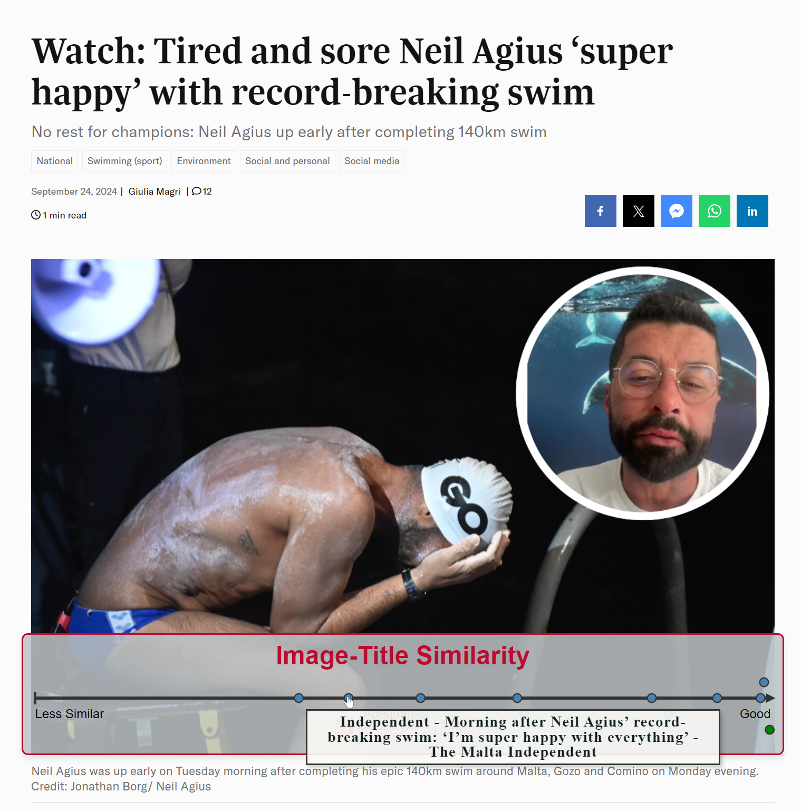

# NewsAlign

<p align="center">
    
</p>

NewsAlign is a Chrome web-extension that augments the users webpage when viewing articles from Maltese newspapers. NewsAlign shows additional event-level articles from different sources that provide more context on the news coverage of the article being read. These event-level articles are displayed on our novel image-text similarity spectrum, which highlights the thumbnail-headline similarity of that article; hinting at potential picture-related bias. This is done via a Vision-Language Model (VLM) namely BLIP-2. Additinally, LLaMA3.1-8B-instruct is used to provide personalised summaries and explanations from all available event-level articles.

NewsAlign's backend and frontend code is made public, however as of 21/01/2025 the backend is not running on any live server. NewsAlign is part of a broader research project funded by Xjenza Malta.

Read the documentation here.

<p align="center">
    
    
    
</p>

---

## Installation and Usage

Disclaimer: NewsAlign is only intended for research purposes ad is not yet production-grade. Run at your own risk.
The following steps only apply to **Windows 10/11**


### Preliminary steps

#### Install the necessary requirements

```bash
conda create --name vectordb -y python=3.9.19
conda activate vectordb
pip install --user -f listener_requirements.txt
python -c "import torch; print(torch.cuda.is_available())" #True

```

Both the news article listener and NewsAlign depend on two local services hosted via APIs on 8000 and 8001 respectively. This is becuase of a dependency conflict between BLIP-2 from `salesforce-lavis` and `nomic-embed-text-v1`. As a result, two seperate processes running the below commands must be spawned before initiating.

NOTE: This is a temporary workaround and should be fixed going forward.

#### Terminal 1

```bash
conda activate vectordb
cd newsalign/src
#Currently VectorDatabase is hosted on local disk in newsalign\src\vector_db\vector_db\
chroma run --host localhost --port 8000 --path .\vector_db\vector_db\
```

#### Terminal 2

```bash
conda activate vectordb
cd newsalign/src
uvicorn vectordb_emb_api:app --host=localhost --port=8001
```


### News Article Listener - Usage

```bash
conda activate vectordb
cd newsalign/src
python listener.py
```

`listener.py` should periodically check for any new articles from the five Maltese newspapers supported (Times of Malta, Malta Today, The Malta Independent, The Shift, Newsbook). Both the textual and visual content of the articles will be saved in their respective ChromaDB collection, namely `txt_collection` via `nomic-embed-text-v1` and `img_collection` via `blip-2`. Refer to NewsAlign technical specifications document for the database schema.

---

### NewsAlign - Installation

NewsAlign depends on two backend processes, namely `main.py` and `start_chat.py`. `main.py` is responsible for event-level article retrieval and performing image-text similarity matching via `blip-2`, while `start_chat.py` handles the chatbot feature. It is possible to run `main.py` alone to only enable the image-text similarity spectrum, however the chatbot feature depends on the `main.py` process.

Since NewsAlign is an extension backend, it requires a reverse proxy like `nginx`.

#### Step 1

[Install nginx](https://docs.nginx.com/nginx/admin-guide/installing-nginx/installing-nginx-open-source/)

#### Step 2

Replace the `nginx.conf` configuration file with the one provided in the repository. If hosting the API on HTTPS, make sure to supply the necessary public/private keys in `certs/`.

#### Step 3

```bash
conda create --name newsalign -y python=3.9.19
conda activate newsalign
pip install --user -f newsalign_requirements.txt
```

#### Step 4

NewsAlign makes use of an access token to ensure that not everyone who discovers the IP+port of the server can access the back-end of the extension. Create a new environment variable called `AI_EXT_TOKEN` and set it to a string of your choice. Anyone making use of the NewsAlign will be required to enter this string before accessing the system.


### NewsAlign (Server) - Usage

#### Step 1

Run nginx.exe

```bash
cd nginx-1.27.2 #The folder where your conf files are
nginx.exe
```

#### Step 2

Activate the iamge-text similarity spectrum.

```bash
conda activate newsalign
cd newsalign/src
python main.py
```

#### Step 3

Activate the chatbot feature.

```bash
conda activate newsalign
cd newsalign/src/
python start_chatbot.py
```


### NewsAlign (Chrome Extension) - Usage
Distribute the folder `frontend` to anyone wishing to use NewsAlign. Users should [load an unpacked extension](https://knowledge.workspace.google.com/kb/load-unpacked-extensions-000005962) in Chrome Extension manager.

### Contact

Don't hesitate to contact me for any queries or help.  
Email: [gabriel.hili@um.edu.mt](mailto:gabriel.hili@um.edu.mt)


